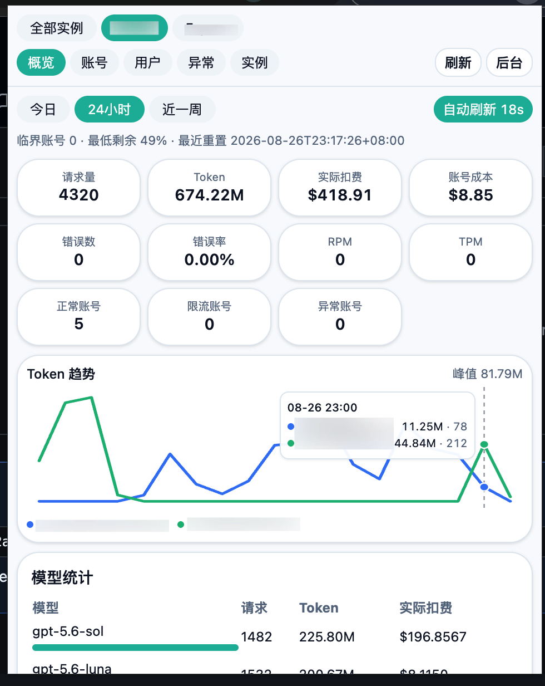
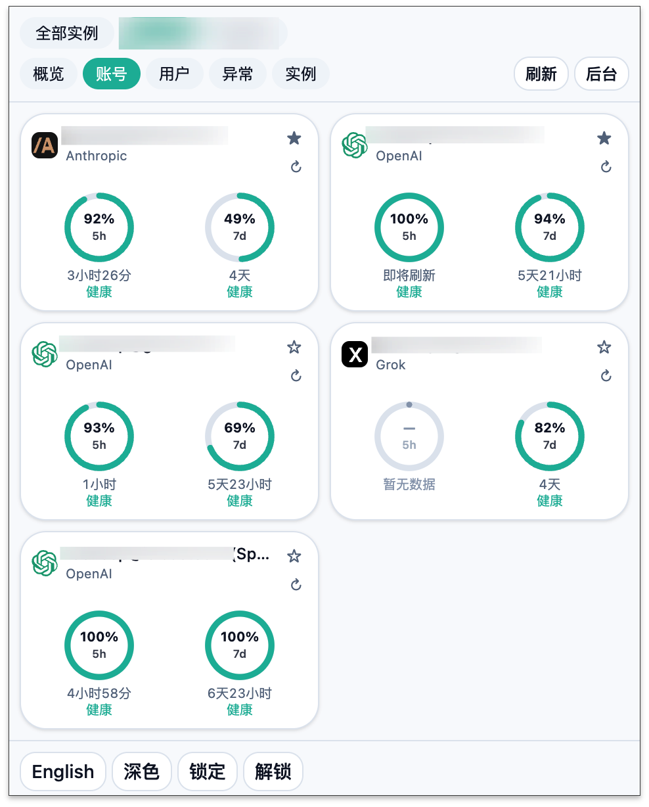

# Sub2API Console

<p align="center"><a href="README.md">English</a> · <strong>中文</strong></p>

<p align="center">
  
</p>

<p align="center">
  <strong>Chrome / Edge 上的 Sub2API 多实例管理控制台</strong><br>
  点一下工具栏图标，就能看额度、用量、用户和异常，而不用打开后台网页。
</p>

<p align="center">
  <a href="https://github.com/Wei-Shaw/sub2api">Sub2API</a> 的第三方浏览器扩展 · Manifest V3 Popup · 不注入页面
</p>

---

管理一台 Sub2API 时，打开后台就够了。管 **好几台** 的时候，来回切站点、对额度、查谁在烧 Token，就会很烦。

**Sub2API Console** 把多台实例收进同一个 480×600 的弹窗里：概览相加、账号配额一眼能看出剩余、用户按花费排序、异常直接看最近的限流和报错。凭证默认记住且不锁密钥，重载后无需解锁。写操作必须显式打开「允许写入」并填写原因。

界面语言跟随浏览器（中文 / 英文），也可在弹窗底部手动切换。

介绍页：[rdshoep.github.io/sub2api-extension](https://rdshoep.github.io/sub2api-extension/)

<p align="center">
  
</p>
<p align="center">
  
</p>

## 能做什么

### 多实例，一个入口

- 添加任意数量的 Sub2API 站点（显示名 + Base URL + Admin API Key 或 JWT）
- 顶部 Tab 在 **全部实例** 和某一台之间切换，关闭后再打开会记住上次选中的实例
- 「全部实例」会把请求量、Token、费用、错误 **加总**，配额剩余百分比 **不会被平均掉**
- 某一台挂了，其它台的数据照常显示，并给出部分失败提示

### 概览

- 今日 / 近 24 小时 / 近一周
- 请求量、Token、实际扣费、账号成本（带 `$`）、错误率、RPM / TPM
- 正常 / 限流 / 异常账号数量
- **多用户 Token 趋势**：像 Sub2API Dashboard 底部那样，一条线一个用户，悬停看该时间点的用量
- 模型统计表

### 账号额度

- 每个上游账号一张卡片：平台 Logo、5h / 7d 环形剩余
- 环心是剩余百分比，下方是状态（健康 / 预警 / 耗尽 / 数据过期…）和 **刷新倒计时**
- 数据过期时圆环仍按上次进度绘制，整圈变灰，可单独点 ↻ 强制刷新该账号
- 星标置顶，常用账号固定在最前

### 用户

- 按今日消费、余额排序
- 左侧状态条：绿 = 正常，黄 / 红 = 异常
- `邮箱 (别名)`，余额和今日消费带货币单位
- 可调整余额、重置某个用户在某个平台的日 / 周 / 月窗口（需允许写入）

### 异常

- 拉取近 24 小时请求 / 上游错误
- 点「后台」可跳到该实例的 Admin Dashboard

### 安全与权限

- **没有 content script**，不会改你正在看的网页
- 安装时 **不要** `<all_urls>`；只有你添加某个实例时，才申请该站点的精确 origin
- 凭证默认 **不锁密钥并记住**（重启后无需解锁，推荐）。也可为单个实例配置密码锁定（AES-GCM）；仍可选择仅保存在当前会话
- 写操作：只读开关 + 能力探测 + 必填原因 + 变更前后对照 + 防重复提交
- 概览 / 账号 / 用户 / 异常支持本地缓存（1 天），先出缓存再刷新

## 安装

需要 Node.js 20+ 和 [pnpm](https://pnpm.io/)。克隆本仓库后：

```bash
pnpm install
pnpm build
```

1. 打开 `chrome://extensions` 或 `edge://extensions`
2. 打开右上角 **开发者模式**
3. **加载已解压的扩展程序**，选中仓库里的 `.output/chrome-mv3`
4. 把图标钉到工具栏，点击即可打开

打包 zip：`pnpm zip` → `.output/*.zip`

## 第一次使用

1. 打开扩展，进入 **实例**
2. 填写显示名称、站点地址（`https://your-host` 或带 `/api/v1` 都可以）
3. 选择 `admin-api-key` 或 `jwt`，粘贴管理员凭证（不要提交到 Git）
4. 建议先勾选 **只读**。**记住凭证**默认开启（推荐）；需要时再勾选锁定并设置密码。然后点「测试并保存」
5. 切到 **概览 / 账号 / 用户 / 异常** 查看数据

写余额或重置配额时，请关掉该实例的只读，并在确认框里写明原因。

## 不是什么

- 不是 [Sub2API](https://github.com/Wei-Shaw/sub2api) 官方扩展，而是对接其 Admin API 的社区控制台
- 不会代理或转发你的模型请求，只读（或按你授权写入）管理接口
- 不实现网站登录 Cookie / JWT 自动刷新；401 时请重新填入凭证
- Firefox 未作为目标平台

## 开发

```bash
pnpm install
pnpm dev          # Chrome 开发模式
pnpm typecheck
pnpm lint
pnpm test:unit && pnpm test:component && pnpm test:contract && pnpm test:e2e
pnpm build
```

技术栈：WXT 0.20 · Vue 3 · TypeScript · Pinia · Tailwind CSS。

更多说明：

- [架构](docs/architecture.md)
- [Sub2API API 对照](docs/sub2api-api-map.md)
- [安全](docs/security.md)
- [本地开发](docs/development.md)

## License

尚未选定开源许可证。在仓库根目录加入 `LICENSE` 之前，请先与作者确认使用方式。

---

如果你也在同时盯着好几台 Sub2API，希望这个弹窗能少让你开几个后台标签页。Issue 和 PR 都欢迎。
